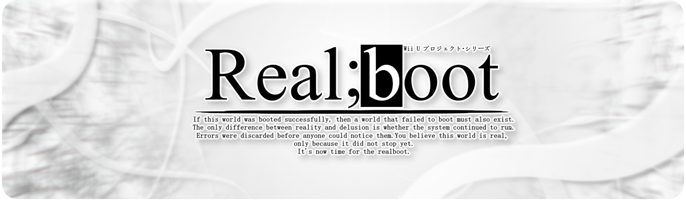

 <h1 align="center">
   
 </h1>

<h1>Realboot Project</h1>
"𝐈𝐟 𝐭𝐡𝐢𝐬 𝐰𝐨𝐫𝐥𝐝 𝐰𝐚𝐬 𝐛𝐨𝐨𝐭𝐞𝐝 𝐬𝐮𝐜𝐜𝐞𝐬𝐬𝐟𝐮𝐥𝐥𝐲, 𝐭𝐡𝐞𝐧 𝐚 𝐰𝐨𝐫𝐥𝐝 𝐭𝐡𝐚𝐭 𝐟𝐚𝐢𝐥𝐞𝐝 𝐭𝐨 𝐛𝐨𝐨𝐭 𝐦𝐮𝐬𝐭 𝐚𝐥𝐬𝐨 𝐞𝐱𝐢𝐬𝐭.  
𝐓𝐡𝐞 𝐨𝐧𝐥𝐲 𝐝𝐢𝐟𝐟𝐞𝐫𝐞𝐧𝐜𝐞 𝐛𝐞𝐭𝐰𝐞𝐞𝐧 𝐫𝐞𝐚𝐥𝐢𝐭𝐲 𝐚𝐧𝐝 𝐝𝐞𝐥𝐮𝐬𝐢𝐨𝐧 𝐢𝐬 𝐰𝐡𝐞𝐭𝐡𝐞𝐫 𝐭𝐡𝐞 𝐬𝐲𝐬𝐭𝐞𝐦 𝐜𝐨𝐧𝐭𝐢𝐧𝐮𝐞𝐝 𝐭𝐨 𝐫𝐮𝐧.  
𝐄𝐫𝐫𝐨𝐫𝐬 𝐰𝐞𝐫𝐞 𝐝𝐢𝐬𝐜𝐚𝐫𝐝𝐞𝐝 𝐛𝐞𝐟𝐨𝐫𝐞 𝐚𝐧𝐲𝐨𝐧𝐞 𝐜𝐨𝐮𝐥𝐝 𝐧𝐨𝐭𝐢𝐜𝐞 𝐭𝐡𝐞𝐦. 𝐘𝐨𝐮 𝐛𝐞𝐥𝐢𝐞𝐯𝐞 𝐭𝐡𝐢𝐬 𝐰𝐨𝐫𝐥𝐝 𝐢𝐬 𝐫𝐞𝐚𝐥,  
𝐨𝐧𝐥𝐲 𝐛𝐞𝐜𝐚𝐮𝐬𝐞 𝐢𝐭 𝐝𝐢𝐝 𝐧𝐨𝐭 𝐬𝐭𝐨𝐩 𝐲𝐞𝐭.  
𝐈𝐭'𝐬 𝐧𝐨𝐰 𝐭𝐢𝐦𝐞 𝐟𝐨𝐫 𝐭𝐡𝐞 𝐫𝐞𝐚𝐥𝐛𝐨𝐨𝐭." 

## About
The Realboot Project is an attempt to recreate the  *MAGES Engine* on Unity for Wii U, combining the reverse engineering work of The Committee of Zero and my own to understand how Steins;Gate and Chaos;Head NoAH works. This project aims to faithfully recreate the experience of the original game while optimizing it for Nintendo's console.

The main objective is to run Steins;Gate, Chaos;Head NoAH, and Chaos;Child natively on the Wii U. Also, a Mobile and PC support is meant to be made
## Current state of the project
Realboot Engine emulate the behavior of the Android verison of Steins;Gate with a lot of changes in it to make it more accurate to the PC version of the game.
For now, it :
- Read the scripts correctly (and parse the dialogs)
- Read the macrosys call (it does not interpret them yet)
- play sound effects
- play voice lines
- change background correctly
- interpret the labels & the jumps
- Calculate lip syncs for sprites

what it doesn't do yet :
- phone mechanics
- sprite display and reader
- full CPK and SRC reader (for now you need to manually extract assets to 'Assets/Ressources')
- Video player/Interpreter
- multiple games support (at the end, Realboot Engine is meant to support Chaos;Head NoAH, Steins;Gate, and Chaos;Child). For now it only work with Steins;Gate
- Full Wii U Support
